# ACME-500

**A virtual enterprise of 500 knowledge workers, and its automation, in one C++17 binary with no dependencies. It exists so that a method for automating organizations can be graded by a world that answers in seconds instead of quarters, and can fail cheaply before any real firm is asked to be the grader.**

About 8,000 lines on branch `v2` (v1 is tag `v1-step-A`). Eight modes. Thirty-seven oracles in the binary and four on the source tree, each carrying a lie that it must be seen to catch. Every number it prints is a reading, and the readings that turned out wrong are printed as retractions in the receipts.

```
g++ -O2 -std=c++17 -Iinclude -Wall -Wextra -ffp-contract=off src/main.cpp -o acme
./acme --selftest
```

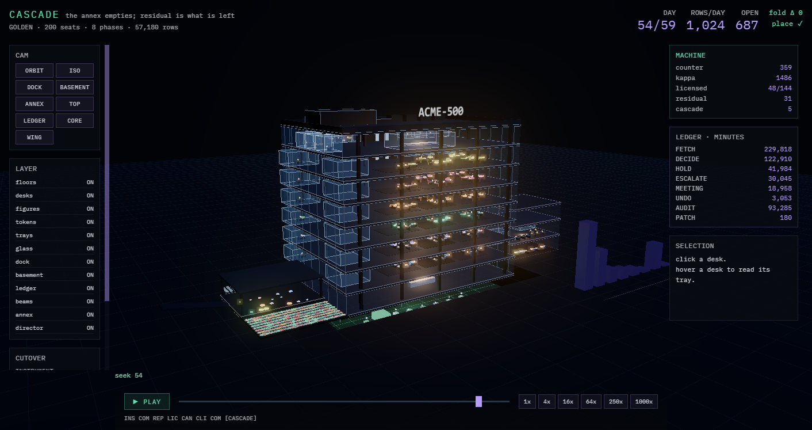

*The observer at day 59 of the golden, phase CASCADE. Every desk lamp, token, tray, glass room and darkened floor is driven by a row on the tape; nothing is animated on its own.*

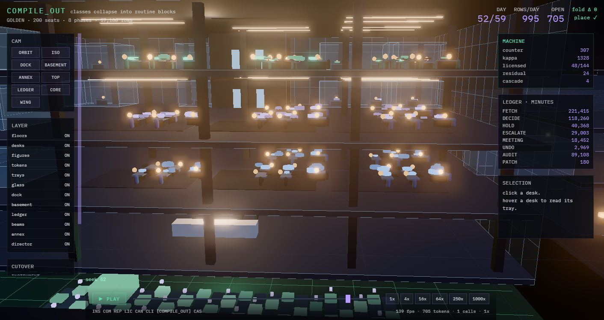

*One department floor. Pods of eight with the lead at the head, managers in glass offices on the window wall, tokens on the desks sized by value, trays stacking the holds.*

## Why it exists

An organization is treated here as a function from events to effects that was implemented in people because people were the only substrate that could hold context. The method that automates it ([docs/METHOD_TWO-GRADERS-TWO-BANDS.md](docs/METHOD_TWO-GRADERS-TWO-BANDS.md)) compiles the firm's decision classes from its own applications, replays its settled history to license the band where the machine's choice was the firm's, runs canaries on every class at the identifiability floor to license the rest, climbs a ladder on arrived outcomes only, and lets the middle of the org chart leave by arithmetic. Every step in that sentence is a claim, and a real firm grades claims at the pace the world answers: a chaser in days, an invoice in a quarter, a hire in a year.

ACME-500 is a firm with planted truth. The tacit mass of each decision class, the competence of each seat, the support coefficient and the fixed floor of the headcount cascade, the judgment intensity of each class: all planted, none shown to the instrument. The instrument must recover them from the tape, and an oracle checks that it did. That makes three things possible that a deployment cannot do:

1. **Falsify the method before a customer does.** The first run found seven defects under its own headline numbers, retracted the headline, and found that its coverage estimator's premise was false. Those receipts are in this repository, unedited.
2. **Measure the number a real programme can never get.** A real firm's canary and its control share one ledger, so the within-firm estimate of the machine's effect is biased by selection and interference and nobody can say by how much. A twin runs two firms on one seed with nothing shared and prints the bias. At E0 it is +34.4 points.
3. **Show the instrument running**, with its refusals, its holds, its kappa, and its own retractions, so that what a buyer sees is a reading and not a promise.

It is a falsifier first, a gym second, and a demonstrator last. **It tests the instrument, never a business.** No number here has met a real firm.

## Status, 2026-09-15

| receipt | result |
|---|---|
| [first run](receipts/RECEIPT_ACME500_FIRST-RUN_2026-09-13.md) | 15 of 16 oracles; twelve of fourteen lie arms catching their lie; seven defects found with lines, most of them under the headline numbers |
| [honest instrument](receipts/RECEIPT_ACME500_HONEST-INSTRUMENT_2026-09-13.md) | 16 of 16; all fourteen lie arms seen to fire; the coverage estimator replaced by one graded by the world (error 0.05 to 0.07, correlation 0.84 to 0.96 on three seeds); the twin's cost sign reversed by pricing the backlog; the cascade restated |
| [step A](receipts/RECEIPT_ACME500_STEP-A_2026-09-14.md) (v2 begins) | O1b, determinism over the machine arm; the dead physics deleted (F15); O28, a tool oracle for uncalled functions; 17 of 17 with fifteen lie arms; every reading identical |
| [step B](receipts/RECEIPT_ACME500_STEP-B_2026-09-14.md) and its remediation | the record is v2 (40 bytes, `via`, `arm` = the decider); the rows the fold was missing; `ledger.h` folds the tape into every cell and the minute meter; O14 fold-to-identity, O15 the ladder is a fold, O25a no clock in the kernel, O29 row shape; the alphabet pin; 20 of 20 with eighteen lie arms; every reading identical |
| [step C0](receipts/RECEIPT_ACME500_STEP-C0_2026-09-14.md) | every consumer reads the folded ledger; the port (`Store::frame`, `Judge::read`) with the plant behind it; O17, the machine links without the plant; the prints that attribute (minutes by via, the binding reason per band, the frame split, the row histogram); every reading identical; F21 found and recorded |
| [step C1](receipts/RECEIPT_ACME500_STEP-C1_2026-09-14.md) | the judge on its own key with its own competence (F16); the kernel's completeness from the compile step; the planted half of the class table out of the kernel's reach (`planted(c)`, `build_acme` in the plant, the cascade fitted from a handed panel, kappa's denominator metered from rows); the read budget with the memo keyed on the frame; the governor in its own translation unit writing STRATUM, LICENSE and KAPPA rows; the licence keyed to the judge; O16, O21, O17 with a second lie; 22 of 22 with twenty lie arms; the first step to move a number, every delta named; F22 found and fixed |
| [step D](receipts/RECEIPT_ACME500_STEP-D_2026-09-14.md) | D0: holds and strata as rows on change (the sim's tape 5.67M → 1.61M rows), the TICK-driven loop; D1: the durable tape in segments with the chain head in each header, the checkpoint with its meta written last, `--resume` from the newest valid one, `--dump` on the observer's contract, O18 with its lie and a real SIGKILL survived; D2: the switch `off/shadow/live/stop` from a file the machine never writes, the pill, the gate as a hashed library (O30a), every EFFECT re-derived from rows (O30), off invisible (O19), shadow agreement 87.2%; D3: the dynamic O25; 26 of 26 with twenty-four lie arms; every reading identical to C1 under `live` |
| [step E](receipts/RECEIPT_ACME500_STEP-E_2026-09-15.md), in progress | E0: a shared fact per class that moves; the judge's certificate through the port carries a proposal across a change when sign and band survive (789 of 2,062 moved frames at 500 seats, 0 disagreements against a fixed judge, O37); unresolved outcomes closed only by a write-off row that is evidence for nothing; outstanding exposure as a fold with the writ's cap (O38): the uncapped machine holds $96M in flight at peak and the licence follows the cap; 28 of 28 with twenty-six lie arms; every default reading identical to D2. E3a: O31 as a mode (`--o31`: a boundary judge the plant holds exactly on the null, every band admitted to the wager as a test) measured the ladder as built before its repair: at 500 seats a judge a delta worse than the incumbent's rate in its band was promoted on 13.7% of bands (Wilson 9.5 to 19.3) against the rule's stated 5%, and a judge at the incumbent's own rate on 28.4%; F23 quantified; the acceptance script runs the lie arms six at a time; every default reading identical to E0. E3b: the ladder v2 (the bar frozen per term at its upper bound from the shadow record and the retained stratum, one process per term at α·2^−k, the mirrored demotion at the point bar, term and lapse above the admitted floor, and F24: each outcome graded against the bar of its act's term), the retained stratum at every rung (O20), the regime detector (O59), the ladder as a fold (O45), O31 restated as the standing share with an exact Bernoulli boundary check; 33 of 33 with thirty-one lie arms. **Numbers move**: licensed decision mass 63.5% → 13.1%, N 193 → 437, bands past rung 0 29 → 11, κ 0.110 → 0.064, because the old rule promoted a null judge on 13.7% of bands and paired the machine against the people's leftover cells (`quote.price` band 2: good_h 0.191 then, 0.849 on the shadow record now); the repaired rule promotes a judge inside the null on 0 of 190 bands at 500 seats; the stub sweep moves licensed mass by 2.6 points from a poor judge to a near-perfect one. E3c: the calibration harness (`calib.h`): the wrong-rate curve per licence key measured on the machine's own executed choices, fitted monotone, frozen per term as CALIB rows the ledger folds and the gate reads; an unmeasured or non-monotone key drafts as `uncalibrated`; O47 with its lie (a confidently-wrong judge admitted on one class); 34 of 34 with thirty-two lie arms; 23 of 24 classes measured and monotone at 500 seats; every default reading identical to E3b, and the gate reading the curve at 0.30 changes 23 acts of 4,454. E4: the account (`panel.h`), folds that feed nothing: the five metrics, CPI for the firm by bucket, the roofline per class with the binding roof, the fusion ledger by reader class, the jury meter, the validity record; the frontier's rental as a `COUNSEL` row; O48 with its lie; 35 of 35 with thirty-three lie arms. **What it reads at 500 seats**: CPI 696.2 minutes per correctly discharged obligation for the incumbent against 326.8 for the resident (the handled count would claim 284.1 against 114.5); 54.0 percent of all minutes are the legal fusion dividend; 24 of 48 wager bands are grading-bound; 22,576 frontier rentals on 5,377 distinct cells; a dumb dissimilar juror is noise (enrichment 1.02×) and a competent sibling is a juror (10.00×) |
| [step F](receipts/RECEIPT_ACME500_STEP-F_2026-09-15.md), in progress | F0a: the tape of tapes. The one stream splits by writer into six lanes (world port, licensor, judge, kernel, human, executor) and merges back, both by pure functions of the row; `SEAL` closes every period over the lanes with the merged head; the merge folds to the same ledger as the flat tape (O42, 0 field diffs over 413,140 rows, 70 seals every one re-deriving from a cold split), while 160,060 rows sit at a different index under it, which the fold does not read. **The sim corrected the design before the build**: lane order alone cannot order the merge, because the world port and the licensor each write twice in a period, so the key is (day, phase, lane, sequence) with nine published phases. Two laws restated by oracles that broke: a NOTE is a row of no period and therefore of no seal (O18), and the seal's head is a chain and so carries the operator's wall reading while no verdict does (O25). 36 of 36 with thirty-four lie arms; every reading identical to E4; the tape gains one row a period and the alphabet pin moves to `0x1304ca15` **Z0: the firm with nobody in it** — `--autark` builds no human arm at all, so a draft and a warrant degrade to a hold, the retained stratum routes to the tier above, and the constitution admits the reversible classes at founding. O60 proves the claim on the tape: of 278,006 rows, **0 carry a seat or human provenance, 0 are DECIDE/ASSIGN/ACT/MEETING, 0 sit on the human lane, 0 escalate to a seat and 0 cells are parked waiting for one**, while the firm acts 13,687 times unattended. Three findings: the round trip was the cost, not the model (52,148 rentals for 2,288 acts, cut 16-fold by a counsel memo keyed on the frame and an escalation that terminates); **two ignition deadlocks of one class** — no history means no admitted rung and no calibration curve, and each gate that demands evidence deadlocks separately once nobody is inside the boundary, so **every evidence gate must name its ignition**; and the first O60 missed its own lie, because an escalation to a seat carries machine provenance and looks like a machine row, so the property is two claims and not one. At 200 seats the zero-seat firm decides 25% of arrivals at the canary rung and 68% at the next, against a 50.4% good rate. 37 of 37 with thirty-five lie arms; the human planet moves one number — frontier rentals 22,576 → **5,377**, exactly the distinct-cell count E4's account predicted |

The readings as they stand after step C1 (D and E0 moved none of them at the defaults), synthetic firm, one writ, 500 seats, demand 1.5 (the C1 receipt names what moved from v1 and why):

- **The twin.** The resident settles 187k obligations to the incumbent's 82k and ends with 19k open against 124k. It is 3.5 points worse on correctness and 4.6 points worse on the good rate. With the backlog priced at the writ's own stock price, total cost is $1,254M against $1,838M, a delta of −$583M in the machine's favour; with the backlog free, as the first run scored it, the sign is the other way. The within-firm canary estimate reads +29.8 points against a true paired effect of −4.6: **bias +34.4**.
- **The reads.** With the memo keyed on the frame, the resident reads 1,729 cells a period against 3,328 when it re-read every open cell every day; 1,462 a period are carried forward. Behind the port a read is a forward pass, and the read budget is a dial: at 4,000 a day against the 84,000-cell warm backlog the machine wins the queue in a fortnight instead of a day and loses seven points of good rate on the way.
- **The cascade.** Licensed decision mass 63.5 percent. Headcount 500 → 193 with the intercept fitted, 182 with the origin fit that promises a company physics does not allow. The first run printed 500 → 57; that number rested on two of the seven defects and is retracted.
- **The path.** Cells a person decided take 12.0 rows, 1.11 seats and 22.4 days from arrival to disposition; cells the machine disposed of take 6.6 rows, 0.38 seats and 41.1 days — shorter in every row and seat, longer in days because the machine works the cells people never reached. The frontier is rented 78,869 times, 61 percent of them on classes worth $9k–$20k and under one percent on the five worth the most.
- **Exposure.** The uncapped machine holds $96M of unattended decisions in flight at peak; under a $50M cap half the decision mass licenses, under $25M none does in a year. The licence follows the exposure cap.
- **Kappa.** 0.110: 2.3M minutes of review caused against 21.3M minutes of person-work removed, the denominator metered from the firm's own rows per decided cell rather than priced by the plant's formula (which read 0.242).
- **The residual.** Warrant 4.6, counterparty 0.7, frame 10.0 (of which 6.8 waits on the ladder and 3.2 on instrumentation), thin tape 21.1 percent. The first two do not move when models improve.
- **The multiverse** (last run at v1). Ten structural patches, six rollouts each. The three that buy a lane, moving a class's unrecorded determinants into a system of record, take the top three places every time. With the queue priced, acting sooner beats acting later; with it free, the reverse.

Two findings are recorded and not fixed: the novelty score has no variance once lateness is removed from it (F11), and the frontier is re-rented daily for the same escalated case (F12); both are E1′'s. Three were closed in E3: the writ's uniform floor could not bind because the gate consulted the canary flag at rung 1 only (F14, closed by the retained stratum: a person decides a uniform fraction of every class at every rung); the ladder's floor was paid once and not per rung (F21) and its e-process had a plug-in null that reset on promotion with no anytime guarantee (F23), which E3a measured at 13.7 percent false promotions against a stated 5 and E3b replaced with the ladder v2. A sixth, F24, was found and fixed in E3b: with the bar frozen per term and the world answering one latency later, an outcome graded against the arrival term's bar promotes a null judge whenever the bar falls in between, so each outcome is graded against the bar of its act's term. F22 was found and fixed in C1: history admission licensed a coin on the half of history it happened to agree with, until agreement beyond chance became a condition. They are in the receipts with their lines.

## The seven modes

| mode | what it does | wall time, one core |
|---|---|---|
| `--sim [--days 260]` | ACME as it is: 500 skulls passing notes. Prints where the minutes went by act: glue, meeting, fetch, frame, decide, commit, transport, rework. The decide fraction is measured, never asserted. | 4 s |
| `--twin [--days 260]` | both arms on one seeded world with nothing shared: the exact paired counterfactual, and the bias a within-firm canary would have reported | 49 s |
| `--automate [--warm 180 --days 260]` | the whole programme: instrument the boundary, compile from the query log, replay the history, license the agreement bands, canary everything at the floor, climb on arrivals, kappa, the cascade, the residual, the counter on the wall | 47 s |
| `--multiverse [--futures 64]` | policy search over structure: many ACMEs under edited constraints, writ-reweighted with ensemble pessimism; every patch carries an inverse | 35 min |
| `--o31 [--seeds S --at bar\|g0\|g0u --shift X]` | the ladder's false-promotion rate under a boundary judge the plant holds on a stated null (the incumbent's rate, a delta worse than it, or a delta worse than the bar at its upper bound), every band admitted to the wager as a test; the standing share of unearned authority at every term boundary, the judge's true position from the coins it spent, and the split of bands by which side of the boundary it sat on; `--shift` lifts the judge off the boundary to draw the power curve | 50 s a seed at 500 seats |
| `--stub-sweep` | the plant judge at fixed competences 0.40 to 0.96 behind the port: licensed mass must be smooth and monotone in the competence (F-STUB) | five automates |
| `--selftest [--lie N]` | the oracle battery; `--lie N` corrupts the mechanism oracle N tests and that oracle must be seen to catch it | about 280 s |

Common flags: `--n 500 --span 7 --demand 1.5 --seed 20260913`; `--budget N` the read budget; `--judge plant|null|rules`, `--judge-comp X` the plant judge at a fixed competence; `--tape DIR` writes the durable tape with a checkpoint every `--ckpt-every K` periods, `--resume` continues from its newest valid checkpoint, `--dump DIR` writes the observer's files; `--switch off|shadow|live|stop` and `--switch-file PATH` (read by the port every period, a change is a NOTE row), `--pill PATH` the heartbeat `tools/pill.py` reads; `--shared [--flip-rate R]` a shared fact per class that moves, `--check-shared` re-reads every certificate carry, `--unresolved R` a world that sometimes never answers, `--exposure-cap V` the writ's cap on outstanding exposure in dollars; `--m-min N` the paired arm's outcomes a bar needs before it is measured (the writ's 200), `--shift-day D --shift-mult M` a planted shift of the arrival rate from day D (the regime detector's world); `--thin-wrong X` the gate reads the calibrated wrong-rate against X where it read the raw direction against the thin margin (the writ's 0 = off), `--m-calib N` the cells graded on the machine's own executed choice before a key's curve is measured (the writ's 30).

## The oracle battery

Every oracle carries a lie. Under `--lie N` the mechanism oracle N claims to test is corrupted on purpose, and oracle N prints PASS only if it caught the corruption; a healthy lie run exits 0 like the plain battery. CMake asserts the caught line per oracle (`PASS_REGULAR_EXPRESSION` on that oracle's id, `FAIL_REGULAR_EXPRESSION` on any FAIL) and never accepts a nonzero exit for an unrelated reason as a caught lie. That last clause was learned the hard way: the first harness marked every lie arm `WILL_FAIL`, one oracle was red for its own reasons, and all fourteen lie tests showed green while one of them was planting its lie in a field its oracle never read.

| oracle | asserts | reading |
|---|---|---|
| O0a | BLAKE2b-256("abc") matches RFC 7693 | PASS |
| O0b | tape chain verifies over 500 rows | PASS |
| O0c | a single flipped field localises to its row | PASS, localised at row -1 |
| O1 | same seed produces a byte-identical tape | PASS, 168519 rows, memcmp |
| O1b | same seed produces a byte-identical MACHINE arm: tape, chain, licence table | PASS, 411781 rows; rec same, chain same, licence table same |
| O14 | the ledger folds from the tape: cold fold == the live ledger every consumer reads | PASS, 58367 cells folded from 411781 rows; 0 field diffs; 0 minute diffs; alphabet pin matches |
| O29 | every row carries what the v2 table says it carries | PASS, 411781 rows scanned, 0 shape faults |
| O15 | the ladder is a fold of OUTCOME rows: counts rebuilt == live | PASS, 72 class-bands; 0 count diffs against the live ladder |
| O16 | a null judge and a rules judge license nothing, from history or the wager | PASS, null judge: top rung 0, 0 LICENSE rows, 0 wager outcomes; rules judge: top rung 0, 0 rows, 0 outcomes |
| O21 | the canary draw is independent of the machine's band | PASS, chi-square 70.3 on 72 class-band cells against a 99.9% point of 114.9 |
| O18 | a kill survives: the durable tape reopens, the checkpoint restores, the run continues bit for bit | PASS, cut at row 362621 + 17 bytes with checkpoint 59 in flight; restored at day 49, 60317 rows dropped; continued run: 411782 rows, chain verified, 0 fold diffs, rows equal the unkilled run's |
| O30 | every EFFECT re-derives from rows: proposal, stratum, folded rung, schema, switch, the gate's own inputs | PASS, 47628 effects re-derived through the gate: 47628 agree, 0 mismatched, 0 band mismatches, 0 without a proposal |
| O19 | off is invisible: no effect, and the incumbent's rows equal a run with no machine | PASS, 0 effects under off; 288051 incumbent rows against 288051 with no machine, byte-identical |
| O25 | the same rows at different wall spacing give identical verdicts: the machine reads the day, never the clock | PASS, 411781 rows against 411781; 70 TICK rows carry a different wall value and 70 SEAL rows a different merged head, because the chain covers that value; every other byte identical |
| O37 | the shared fact: a proposal is carried across a change only on the judge's certificate, re-derivable from rows, and read again where a margin crosses | PASS, 33 changes of a shared fact; 595 frames moved by it: 267 carried by the certificate, all 267 re-derived from rows, 267 checked against the judge with 0 disagreements; 328 read again, of which 117 changed choice and 291 changed band |
| O38 | outstanding exposure never exceeds the writ's cap, an unanswered cell is closed only by a write-off row, and a write-off is evidence for nothing | PASS, cap $300k; the fold's outstanding peaked at $300k, 0 rows over the cap; 14754 acts held for exposure; 489 write-offs, each a row; the ladder counted 35 wager outcomes against 35 answered; the live ledger's outstanding equals the fold's |
| O20 | the retained stratum never reaches zero: drawn at every rung, decided by a person, never acted on while retained | PASS, 1496 cells drawn into the control arm at eps_floor 0.03; 1304 decided by a person; 0 acted on by the machine while retained; 4809 incumbent outcomes landed in the live period |
| O31 | the ladder v2 leaves a judge inside the null with unearned authority no more of the time than its level (at the exact boundary in a Bernoulli world 183 of 20000 band-terms crossed the first earned rung's threshold, rate 0.0092 against alpha/4 = 0.0125, bound 0.0140; the plant: 3 seeded firms, 114 bands run, the judge on each term's frozen g0 less three points: over the 8837 settled wager cells the process graded, expected good rate 0.3337 from its coins, observed 0.3403, the g0 of their acts' terms 0.4597, so INSIDE the null; 0 ever promoted; 0 of 432 band-terms standing above the test rung, share 0.0000 against alpha 0.05, bound 0.0706; against each band's lowest g0 across terms (mean spread 0.271): 40 bands below it with 0 promoted, 43 above it with 0 promoted) | PASS |
| O31b | the standing share holds under a shared fact that correlates outcomes within its epochs (the shared fact moved; 3 seeded firms, 114 bands run, the judge on each term's frozen g0 less three points: over the 8903 settled wager cells the process graded, expected good rate 0.3271 from its coins, observed 0.3292, the g0 of their acts' terms 0.4450, so INSIDE the null; 0 ever promoted; 0 of 432 band-terms standing above the test rung, share 0.0000 against alpha 0.05, bound 0.0706; against each band's lowest g0 across terms (mean spread 0.273): 43 bands below it with 0 promoted, 43 above it with 0 promoted) | PASS |
| O45 | the ladder v2 is a fold: the bars, both processes and every LICENSE row re-derive from rows | PASS, 72 class-bands; 0 diffs against the live ladder; 64 LICENSE rows folded, 0 unjustified |
| O59 | the regime detector fires on a planted shift of arrivals and stays quiet without one | PASS, a 1.6x shift from day 80: 32 REGIME rows, 20 bands dropped to watching; the world without a shift: 0 REGIME rows |
| O47 | the calibration curve per key is monotone, frozen per term as rows, and an unmeasured or non-monotone key licenses nothing | PASS, 384 CALIB rows over 2 terms; 13 of 24 classes measured, 13 of those monotone, 0 ever flagged non-monotone; 4694 unattended acts, 0 on a key unmeasured or not monotone |
| O48 | the account folds from the tape: every panel number from a cold fold equals the live panel's (the live panel against a cold fold: minutes 2852.4k vs 2852.4k (meetings 459.9k vs 459.9k), correctly discharged 13987 vs 13987, CPI 203.9 vs 203.9, waits 8.6/13.6 vs 8.6/13.6 days; 2068 rentals on 2068 distinct cells) | PASS |
| O42 | the tape of tapes: every SEAL re-derives from a cold split, and the lanes merged in the published order fold to the flat tape's ledger | PASS, 411781 rows over 6 lanes: world 88045 · licensor 51885 · judge 52490 · kernel 53683 · human 165676 · executor 0; 70 seals, 0 whose merged head did not re-derive, 0 rows of a sealed period written after its seal; the merge folds to the same ledger: 0 field diffs; 158720 of 411781 rows sit at a different index under the merge, which the fold does not read |
| O60 | the human lane is empty: under the autark constitution no row carries a seat and the firm still acts | PASS, 278006 rows over 30 days with nobody inside the boundary: 0 carry a seat or human provenance, 0 are DECIDE/ASSIGN/ACT/MEETING, 0 sit on the human lane, 0 escalate to a seat and 0 cells are left parked waiting for one; the firm acted 13687 times unattended and rented 977 times |
| O2 | the gate never authorises outside its licence | PASS, 8640 lattice points, 390 reached ACT; pressure never widened; off held every point; an exhausted exposure allowance held every act and moved nothing else; retained held every point; an unmeasured key never acted off the canary, and on it acted only as one |
| O3 | out of supervision degrades to HOLD, never to acting | PASS |
| O4 | transport conserves: rows ship, columns never exceed | PASS, max column overshoot 0.00e+00, placed+stock err 1.30e-08 |
| O5 | a binding capacity has a nonzero price, stocks included | PASS, binding seat price 29.6598, unplaced-stock price 28.0206 |
| O6 | the join graph is read off the application, not asked for | PASS, 24 of 24 classes, exactly |
| O7 | coverage read off the world's verdicts tracks the tacit mass | PASS, mean |err| 0.054, corr 0.946 over 19 classes |
| O8 | the disagree/firm-failed cell licenses nothing | PASS, 2174 cells available, 21611 credited, 21611 agreements |
| O9 | the field recovers competence no human in ACME can see | PASS, mean within-class corr 0.242 over 9 classes, 209 seat-class pairs |
| O10 | kappa demotes a class that costs more than it saves | PASS, kappa 2.25 -> rung 1 |
| O11 | effects carry inverses; the window closes at settlement | PASS, 60 effects committed and unwound; post-settlement reversal refused |
| O12 | the origin-fit cascade promises an impossible company | PASS, alpha 0.145 vs 0.197 planted; F 17.6 vs 9.0; gap at E=200 is 9 seats |
| O13 | the measured decide fraction ranks the planted intensity | PASS, partial Spearman 0.963 over 24 classes, n_systems controlled; the LEVEL is never recovered |
| O28 | no dead physics: every free function in firm.h/world.h has a caller | PASS, 21 functions |
| O25a | the kernel reads no clock: machine.h, solver.h, ledger.h, report.h, port.h, license.h, tapefile.h, gate.h read time only from TICK rows | PASS |
| O17 | the machine links without the plant or the governor: ledger.h, port.h, license.h, solver.h, machine.h, report.h compile under -DACME_NO_PLANT -DACME_NO_GOVERNOR | PASS |
| O30a | the gate is pinned: include/acme/gate.h digests to its pin ac3c4ba42f610901 | PASS |

*Regenerated from `receipts/step-f-2026-09-16/z0/selftest.txt`, `o28_o25a.txt`, `o17.txt` and `o30a.txt` by `tools/oracle_table.py`; the readings are the run's own lines.*

## How it is built

- **The tape is the only truth.** Append-only, BLAKE2b-chained, fixed-width records; every table is a fold over it. A hold is a row, because an organization fails by omission and an omission that leaves no trace cannot be graded. The interior, the meeting, the deck, the ticket, is recorded only so it can be priced and deleted.
- **The RNG is stateless.** Counter-based, keyed on seed, stream and index, so two arms of a twin get the same arrivals, determinants and luck on every obligation id.
- **One read function, one grader.** The correct decision is the sign of the full weighted sum over a class's determinants. A decider, human or machine, sums only the determinants it gathered, plus noise scaled by the class's judgement intensity and its own competence, through one `observe()` with different masks; the world settles the outcome by comparing the decision to that truth and the day to the due day, without knowing who decided. The load-bearing variable is completeness, through which determinants get summed: who can assemble the context, at what cost, at what rate. (An earlier "quality curve" described here until 2026-09-14 had no caller and was deleted; finding F15.)
- **Determinants live somewhere.** In a system of record behind an application, in the inbound document, or nowhere. Coverage of a class is one minus its tacit mass, and it is a property of instrumentation, which is buyable, not of the model.
- **Two graders with disjoint support.** History grades the band where the machine's choice was the firm's, with zero latency; the world grades the rest, one term late, through the canary. The fourth cell of the table, where the machine disagreed and the firm failed, is refused: the machine's alternative was never run.
- **The gate contains nothing learned.** Five verdicts, a published order of refusal, budget checked last so that running out of supervision produces a hold and never an act. Direction, sharpness and novelty are three numbers, not entropy.
- **κ.** Supervision created over supervision removed, per class-band. The one meter that can fail while every other number improves.

The standing architecture is [docs/ARCHITECTURE_v4.md](docs/ARCHITECTURE_v4.md), a superset: v3 is its Part II verbatim and v2 is verbatim inside that, so every §-reference holds. v2's §14 is the order of steps and §14a/§14b the amendments after review; v3's §18–§23 add the alphabet thesis, the archive plane and the `TapeJudge`; v4's §24–§41 add the fifth world (the closed firm behind the port), lanes, the ladder v2, the constitution in code, the standard, and the order as confirmed on 2026-09-15 (§39.2). [docs/DESIGN.md](docs/DESIGN.md) is v1's design, kept as the receipt of what ran at tag `v1-step-A`.

## The observer

[`observer/`](observer/) is a three.js page that folds the tape and draws the firm as a headquarters: departments as floors, pods of desks with the lead at the head, glass offices, the executive floor, the annex, the resident's basement, the dock where outcomes land. It is a pure observer of a frozen contract and runs from a golden with no backend.

### The eight phases, one camera

The director cuts on the phase boundaries in `phases.json` and on nothing else. Day 0 to day 54 of the golden, ORBIT camera, headless.

| INSTRUMENT | COMPILE | REPLAY | LICENSE |
|---|---|---|---|
| 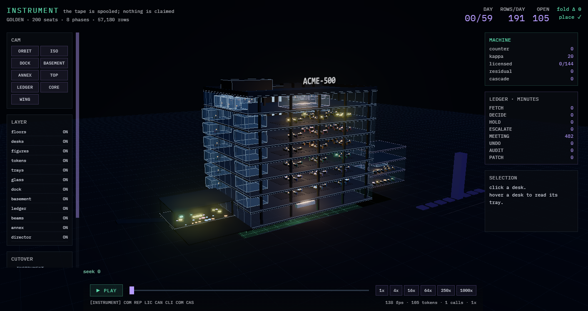 | 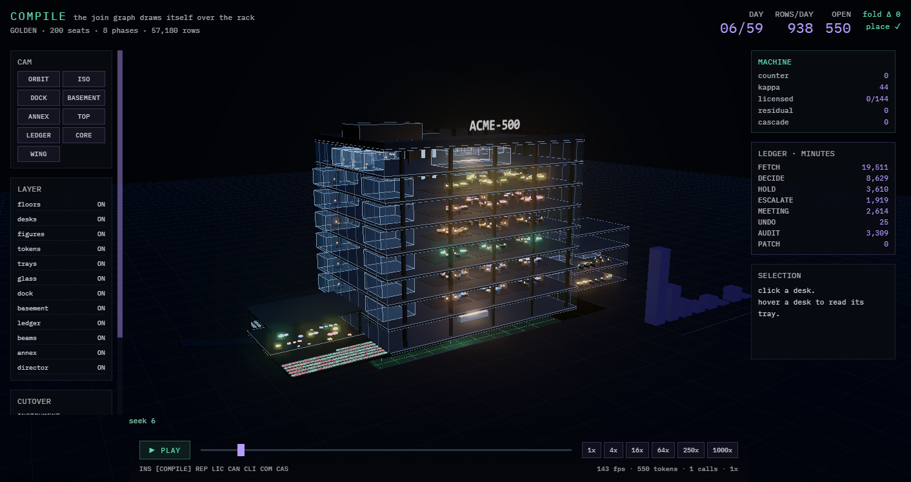 | 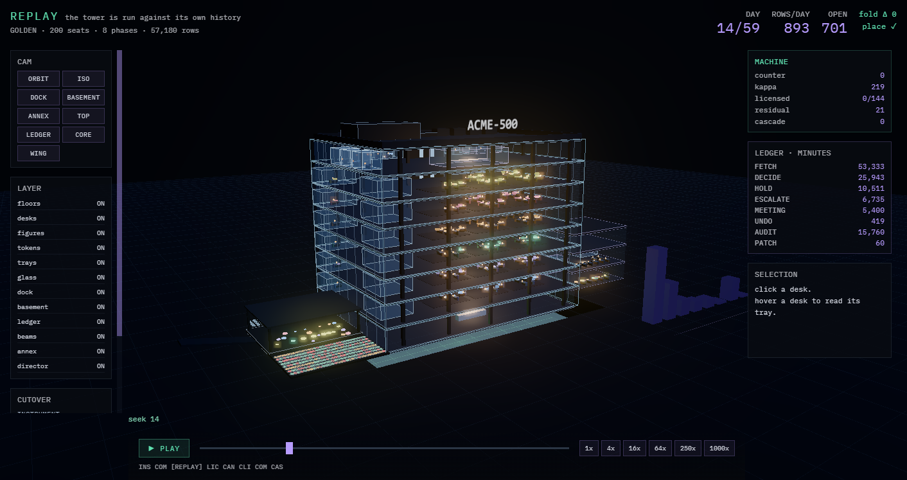 | 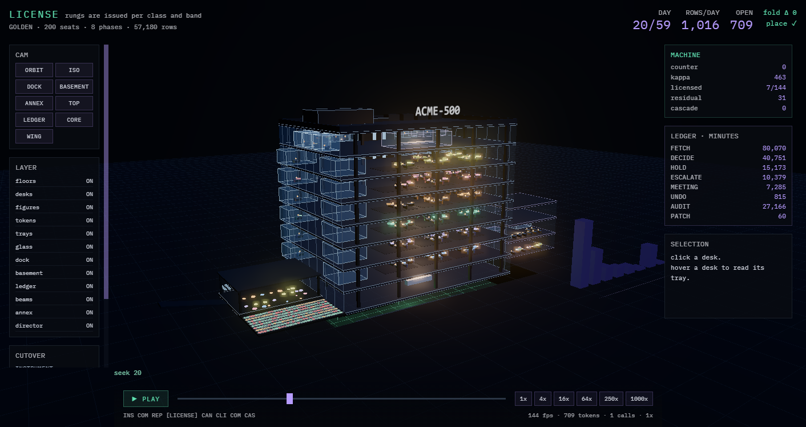 |
| the tape is spooled; nothing is claimed | the join graph draws itself over the rack | the tower is run against its own history | rungs are issued per class and band |

| CANARY | CLIMB | COMPILE_OUT | CASCADE |
|---|---|---|---|
| 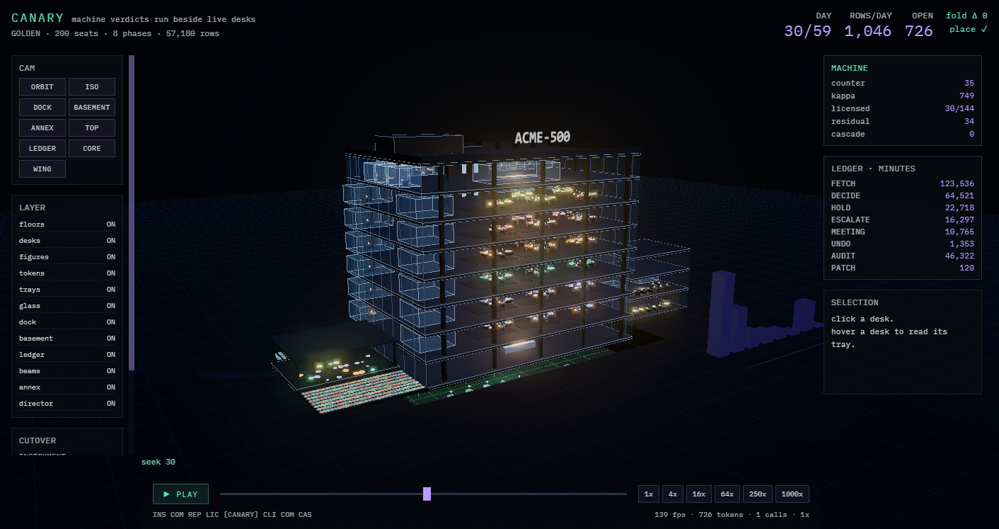 |  | 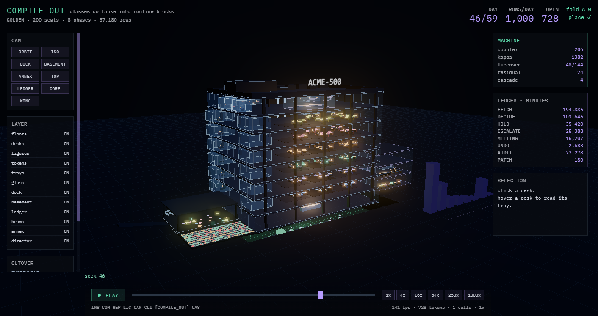 |  |
| machine verdicts run beside live desks | licensed bands climb; floors go quiet | classes collapse into routine blocks | the annex empties; residual is what is left |

### The close cameras

| the dock | the basement |
|---|---|
| 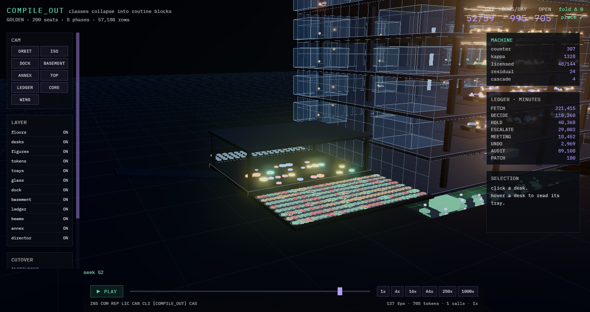 | 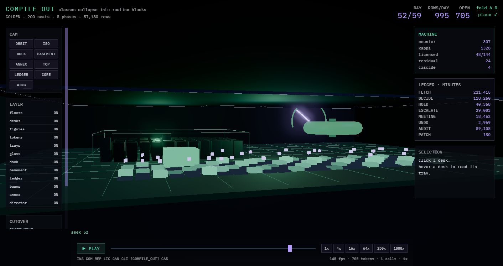 |
| the boundary. Tokens wait in the bay; outcomes land on the apron as marks, green, amber and red, rimmed by who decided; effects leave by the chute. | the resident. The 24 × 6 license grid lit by rung, the purple glyphs where history admitted a band, the spool, the kappa gauge, the rack, and the routine block that grows as classes compile out. |

| the executive floor | the annex |
|---|---|
| 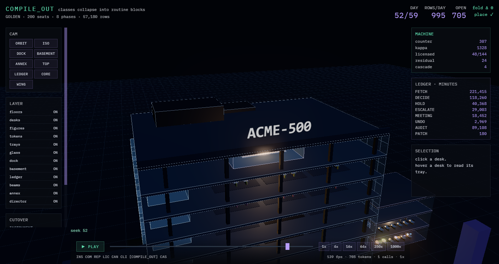 | 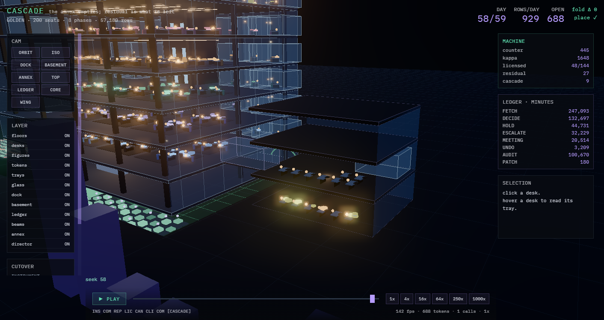 |
| the top: the boardroom at the front, the offices along the back, the sign, the rooftop plant. | the α-functions in their podium, emptying floor by floor during the cascade, after the wings and never before. |

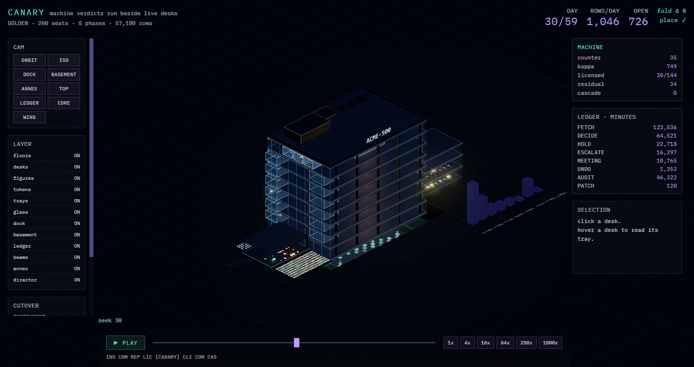

*Isometric. The tower, the annex with its bridge, the dock, the ledger skyline.*

## Layout

```
src/main.cpp              five modes and the oracle battery
include/acme/core.h       the RNG, fixed-point accumulators, BLAKE2b, the 40-byte record and the tape, the schema and its pin
include/acme/firm.h       the cone from the span, the α/E split, skills, the writ, the outcome vocabulary and its price
include/acme/ledger.h     THE LEDGER: the cells, the open set and the minute meter, as a fold of the tape; includes nothing from the plant
include/acme/port.h       THE PORT: Store::frame and Judge::read, the only way the machine touches a world
include/acme/license.h    THE LICENCE TABLE and THE LADDER v2: per class-band, keyed per judge; the bar frozen per term at its upper bound, one evidence process per term never reset, rungs at alpha 2^-k, the mirrored demotion, term and lapse above the admitted floor, each outcome graded against its act's term (F24); the fold of all of it (O45)
include/acme/calib.h      THE CALIBRATION HARNESS: the wrong-rate curve per licence key over |direction| bins, measured on the machine's own executed choices, fitted monotone (PAVA), frozen per term as CALIB rows; an unmeasured or non-monotone key licenses nothing (O47)
include/acme/lanes.h      THE TAPE OF TAPES: the six-lane roster and the nine-phase merge order, both pure functions of the row; the lane set the world port seals each period (SEAL); split and merge, proven to fold to the flat tape's ledger (O42)
include/acme/panel.h      THE ACCOUNT, the instrument panel: the five metrics, CPI for the firm by bucket, the roofline per class with the binding roof, the fusion ledger by reader class, the jury meter, the validity record; folds over rows that feed nothing (O48)
include/acme/gate.h       THE GATE, a hashed library: the verdicts, the sixteen reasons, the alphabet pin, the switch; the thin test on the calibrated wrong-rate when the writ says so; its pin in gate_hash.inc (O30a)
include/acme/tapefile.h   THE DURABLE TAPE: segments with the chain head in each header, the torn tail, the sink
include/acme/checkpoint.h the checkpoint with its meta written last, the tape's meta, the pill, the switch file
include/acme/governor.h   THE GOVERNOR: the salt, the strata as rows (retained at every rung, audit, canary), the terms, the ladder as LICENSE rows with their cause, KAPPA rows, the regime detector's REGIME rows; the machine never includes it
include/acme/world.h      THE PLANT: the planted half of the class table, build_acme, determinants and where they live, arrivals (with a planted shift), the read, the grader; PlantStore, PlantJudge, and the BoundaryJudge that O31 holds on the null
include/acme/human.h      the incumbent arm: the five acts, the glue, the derived meeting calendar, escalation
include/acme/solver.h     the field, log-domain Sinkhorn with finite stocks, the gate, the hand
include/acme/machine.h    compile, invariant mining, replay, the read budget and the memo, the resident (links without the plant or the governor)
include/acme/report.h     the cascade fitted from a handed panel, the residual, the paired arms, the prints that attribute
tools/                    the tool oracles: dead_symbols.py (O28, O25a), o17.py (O17); oracle_table.py regenerates the table above
receipts/                 every run, with commands, outputs, exit codes and what was not done
docs/                     ARCHITECTURE_v4.md (standing; v3 and v2 verbatim inside it), DESIGN.md (v1), the handoff, the method, the observer contract, the briefs
observer/                 the visualization
```

## Working on it

`CLAUDE.md` binds any agent session in this tree and is worth a human's read too: reproduce the baseline battery before editing; a lie arm counts only when the lied-to oracle is seen to catch it; never report a process as running without its PID and CPU time; the physics in `firm.h` and `world.h` is not under review and no constant is tuned to pass an oracle; every step ends in a dated receipt.

The next steps, as confirmed on 2026-09-15 (ARCHITECTURE v4 §39.2): E3 (the ladder v2 with the retained stratum and the calibration harness; O20, O31, O31b, O45, O47; opened by an O31 reading against the ladder as built), then F0 (lanes, the licensor as a process, the replay with no model, the two-process sim), then F1a (the greenfield world and the selection rule; O39, O40, O41), then E1′, E2, G0 and G (one real lane, folded, at `off`), H, H2, and I, the only grader that matters: one real wire.

## License

MIT. See [LICENSE](LICENSE).
